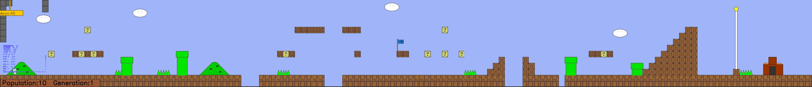
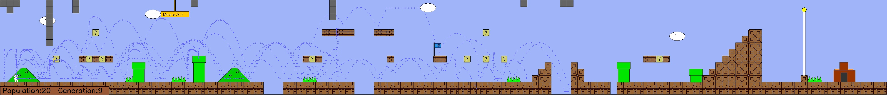

# Cat Mario AI Challenge Project

## Overview
This project, inspired by SethBling's MarI/O and Niko's CrAIg, uses [NEAT (Neural Evolution of Augmented Topologies)](https://en.wikipedia.org/wiki/Neuroevolution_of_augmenting_topologies) to train an AI for playing "Cat Mario," a challenging Mario-like game. The aim is to develop an AI that learns to navigate through the game's deceptive traps and challenges. For more information, you can also refer to this [Medium article](https://medium.com/@savas/craig-using-neural-networks-to-learn-mario-a76036b639ad).

## Dataset and Input-Output Behavior
- **Dataset**: Real-time gameplay video feeds, converted into frames.
- **Input**: Game environment information including character, terrain, enemies, and projectiles.
- **Output**: Simulated keystrokes for the character's movement and actions.

## Result

## Success Metrics
1. **Basic**: Completing a training level.
2. **Intermediate**: Completing an unseen level.
3. **Advanced**: Improving the fitness function for faster training.
4. **Expert**: Optimizing the algorithm for quicker convergence.

